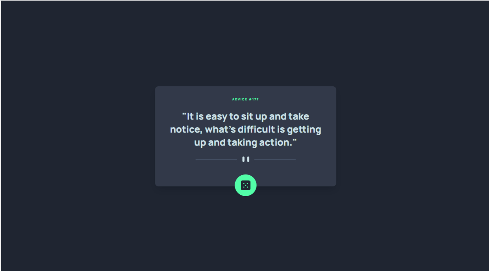
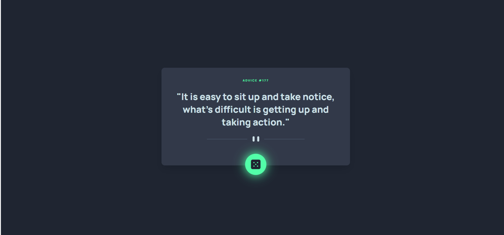
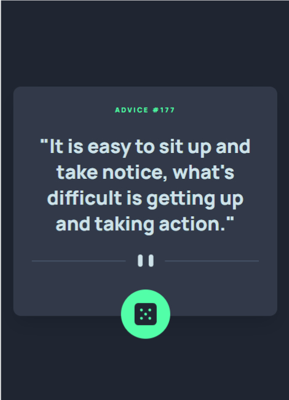

# Frontend Mentor - Advice generator app solution

This is a solution to the [Advice generator app challenge on Frontend Mentor](https://www.frontendmentor.io/challenges/advice-generator-app-QdUG-13db). Frontend Mentor challenges help you improve your coding skills by building realistic projects.

## Table of contents

- [Overview](#overview)
  - [The challenge](#the-challenge)
  - [Screenshot](#screenshot)
  - [Links](#links)
- [My process](#my-process)
  - [Built with](#built-with)
  - [What I learned](#what-i-learned)
  - [Continued development](#continued-development)
- [Author](#author)

**Note: Delete this note and update the table of contents based on what sections you keep.**

## Overview

### The challenge

Users should be able to:

- View the optimal layout for the app depending on their device's screen size
- See hover states for all interactive elements on the page
- Generate a new piece of advice by clicking the dice icon

### Screenshot

### Links

- Repository URL: (https://github.com/Deva-Mari/Advice-generator-app)
- Live Site URL: ([https://your-live-site-url.com](https://calm-pastelito-050005.netlify.app/))

## My process

### Built with

- [React](https://reactjs.org/) - JS library
- Sass preprocessor
- Flexbox

### What I learned

- How to organize a React project into components
- Practiced an API-Request

### Continued development

- Using App-Wide styles

## Author

- Website - [Deva Mari](https://devamari.com/)
- Frontend Mentor - [@yDeva-Mari](https://www.frontendmentor.io/profile/Deva-Mari)
- GitHub- [@Deva-Mari](https://github.com/Deva-Mari)

